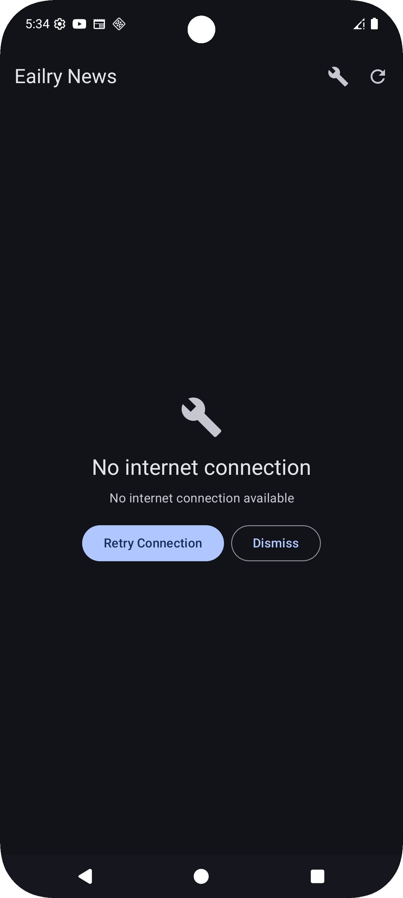

# EailryNews - Modern News App

A modern Android news application built with Jetpack Compose, following Clean Architecture
principles and implementing the latest Android development best practices.

# 📱 App Module

The main application module containing the Application class, dependency injection setup, and app-level configurations for the EailryNews application.

## 📱 Features

- **Single Activity Architecture**: Hosts entire app in one Compose activity
- **Dependency Injection Setup**: App-level dependency configuration
- **Application Lifecycle Management**: Proper initialization and cleanup
- **Global Configuration**: App-wide settings and resource management

## 🏗️ Architecture

### App Module Components
- **Application Class**: Main application entry point with dependency injection setup
- **Main Activity**: Single activity hosting the entire Compose application
- **Dependency Injection**: App-level module configuration

```
App Module Structure:
app/
├── NewsApplication.kt    # Application class
├── MainActivity.kt       # Main Compose activity
└── appModule.kt         # Dependency injection
```

## 🛠️ Tech Stack

### Core Components
- **Kotlin** - Primary programming language
- **Jetpack Compose** - UI framework integration
- **Koin** - Dependency injection framework
- **ComponentActivity** - Compose activity base class

### Architecture Patterns
- **Single Activity Architecture** - One activity hosting all screens
- **Dependency Injection** - App-level service provision
- **Clean Architecture** - Proper separation of concerns

## 🚀 Getting Started

### App Module Setup

1. **Application Class Configuration**
   - Initialize dependency injection
   - Set up global app configuration
   - Configure application lifecycle

2. **Main Activity Setup**
   - Configure Compose UI
   - Set up navigation host
   - Apply app theme

3. **Dependency Injection**
   - Configure app-level dependencies
   - Provide application context
   - Set up singleton instances

### Prerequisites
- Android Studio Narwhal | 2025.1.1 or higher
- JDK 17 or higher
- Android SDK 34+

## 📹 Video Demo

https://github.com/Walid44443/EailryNews/screenshots/video.webm

- **App Launch**: NewsApplication initialization and dependency injection setup
- **Navigation Flow**: Single activity hosting multiple Compose screens
- **State Management**: ViewModel integration with Compose UI
- **Offline Mode**: Local database caching demonstration
- **Architecture**: Clean Architecture layers interaction

## 📱 Screenshots

| Home Screen | Article Detail | Offline Mode |
|-------------|----------------|--------------|
|  |  |  |


## 📄 License

```
MIT License

Copyright (c) 2025 Walid

Permission is hereby granted, free of charge, to any person obtaining a copy
of this software and associated documentation files (the "Software"), to deal
in the Software without restriction, including without limitation the rights
to use, copy, modify, merge, publish, distribute, sublicense, and/or sell
copies of the Software, and to permit persons to whom the Software is
furnished to do so, subject to the following conditions:

The above copyright notice and this permission notice shall be included in all
copies or substantial portions of the Software.
```

## 🙏 Acknowledgments

- **[Jetpack Compose](https://developer.android.com/jetpack/compose)** - For modern UI framework
- **[Koin](https://insert-koin.io/)** - For lightweight dependency injection
- **[Android Developers](https://developer.android.com/)** - For excellent documentation
- **[Material Design 3](https://m3.material.io/)** - For design system integration

## 📞 Contact

**Walid** - [@Walid44443](https://github.com/Walid44443)

Project Link: [https://github.com/Walid44443/EailryNews](https://github.com/Walid44443/EailryNews)